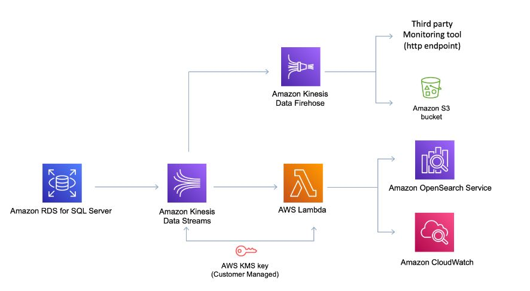

# Processing Database Activity Streams using the AWS SDK for Python

Amazon RDS sends database activities to an Amazon Kinesis data stream in near real time.The same AWS KMS key that you supplied when you launched the database activity stream can be used to decrypt these database activities. From Kinesis , you can monitor the activity stream, or other services and applications can consume the activity stream for further analysis. 
Amazon RDS manages the Kinesis stream for you as follows:
- Amazon RDS creates the Kinesis stream automatically with a 24-hour retention period.
- Amazon RDS scales the Kinesis stream if necessary.
- If you stop the database activity stream or delete the DB instance, Amazon RDS deletes the Kinesis stream.

### Architecture


The module consists of following two lambda functions:

1. **rds-das-decrypt-kinesis-firehose.py** - This lambda function get invoke by Kinesis Data Firehose as a part of Data Transformation to decrypt the audit records and deliver the transformed data to destinations such as Amazon S3, AWS Opensearch, and third party monitoring tools like Splunk.
    
2. **rds-das-decrypt-kinesis-opensearch.py** - This lambda function decodes and decrypts the database activities using the KMS key you provided when starting the database activity stream, filters heartbeat events and any of the events that belong to the 'rdsadmin' and 'rdssec' users, flattens the array of database activities events into individual rows, creates an opensearch index with mapping and ingests records into Amazon Opensearch Service using signing HTTP request. 

### Prerequisites


You need to create a lambda layer to package libraries and other dependencies that you require to execute Lambda functions. To construct a lambda layer with the necessary dependencies like PyCrypto, aws-encryption-sdk, opensearch-py, requests-aws4auth, and cryptography, you can run the commands listed below in a Cloud9 environment.

```
mkdir -p das-rds && cd das-rds
python3 -m venv .venv
source ./.venv/bin/activate
pip3 install PyCrypto aws-encryption-sdk opensearch-py requests-aws4auth cryptography==3.4.8
deactivate
mkdir -p python && cd python
cp -r ../.venv/lib64/python3.9/site-packages/* .
cd ..
zip -r das_layer.zip python
aws lambda publish-layer-version --layer-name das-encryption --zip-file fileb://das_layer.zip --compatible-runtimes python3.9
```

## Security

See [CONTRIBUTING](CONTRIBUTING.md#security-issue-notifications) for more information.

## License

This library is licensed under the MIT-0 License. See the LICENSE file.
